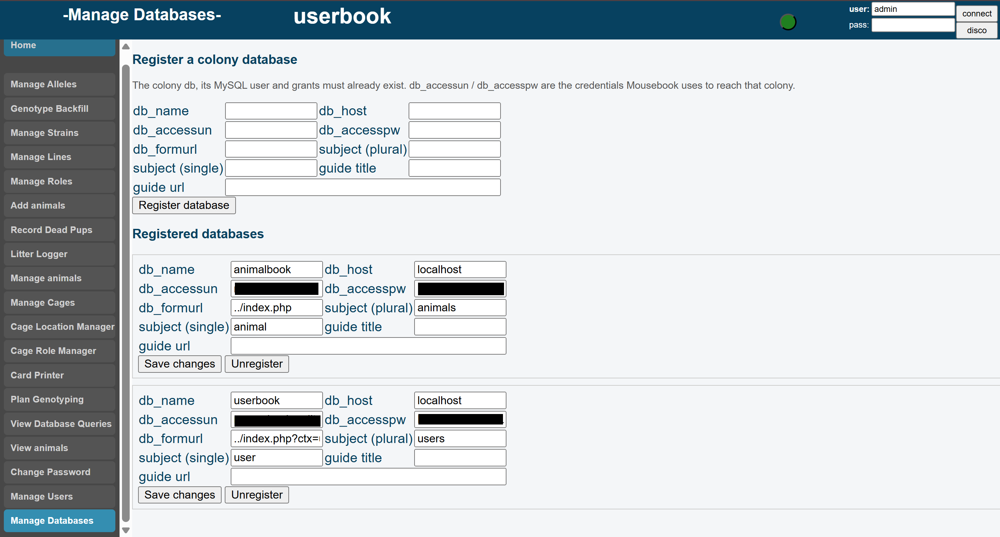

# Mousebook Administrator's Guide

For the person who runs Mousebook for their lab. It assumes the install is done
([INSTALL.md](INSTALL.md)) and that you can log in.

---

## 1. The two databases

Mousebook keeps people and animals in separate databases, and you administer
them in separate places.

| | `userbook` | your colony (`animalbook`, …) |
|---|---|---|
| **Holds** | accounts, passwords, who may open which colony | animals, cages, litters, genotypes |
| **You reach it by** | clicking the **`userbook`** button after logging in | clicking your colony's button |
| **Admin pages** | Manage Users, Manage Databases | Manage Lines, Manage Alleles, Manage Strains, Manage Roles |

The `userbook` button only appears if your account has the `admin` tier on the
auth database. That is what makes you an administrator; nothing else does.

> **If your host prefixes database names**, your auth database is called
> something like `myaccount_userbook`, and that is the name on the button. It
> is recorded in `config.php` as `userbook_db`. Everything in this guide works
> the same way; only the label differs.


*The sidebar changes depending on which database you are in.*

---

## 2. Access tiers

Every user gets a tier **per colony**. There are exactly three:

| Tier | Can do |
|---|---|
| `read-only` | View every page. Every attempted change is blocked, with a notice explaining why. |
| `editor` | Everything read-only can, plus add and edit animals, cages, litters, genotypes. The tier most of your lab should have. |
| `admin` | Everything editor can, plus the management pages (lines, alleles, strains, roles) and — on `userbook` — user administration. |

Two things worth knowing:

- **The values are exact.** `Admin`, `administrator`, `1`, or an empty string
  are all treated as **`read-only`**. This is deliberate: a typo can never
  accidentally hand someone write access.
- **Tiers are per-colony.** Somebody can be an `editor` on one colony and have
  no access at all to another. Giving someone `admin` on a *colony* does not
  make them a Mousebook administrator — only `admin` on `userbook` does that.

---

## 3. Adding a user

1. Log in, click **`userbook`**, click **Manage Users**.
2. Enter their username and email address, and create the account.
3. Mousebook mints a single-use invitation link, valid for 72 hours by default.
   - **With email configured**, it is sent to them automatically.
   - **Without email**, the link is displayed on screen — copy it and send it
     yourself. It is shown once.
4. Grant them access: choose the colony, choose their tier, save.

They click the link, choose their own password, and are in. You never see or
set their password.


*Creating a user and granting them access.*

### Password resets

Users reset their own passwords from the **Forgot password?** link on the login
page (30-minute link). If they cannot receive mail, you can trigger a reset for
them from Manage Users (72-hour link) and pass the link on.

Signed-in users change their own password from **Change Password** in the
sidebar. It re-checks their current password first, and it can only ever change
their own account.

### Removing someone

Revoke their access grants in Manage Users. A user with no grants can still log
in, but sees no colonies and can do nothing.

---

## 4. Setting up a new colony for real use

A freshly installed colony ships with exactly **one cage location (`Limbo`)** and
**one cage role (`Community`)** — enough that the drop-downs are not empty and
the colony works the moment it is created. They are ordinary entries: rename
them, retire them, or add to them freely.

What it does *not* ship with is your facility's actual rooms, or any strains,
alleles or lines. That is your first job, and it is all done from inside
Mousebook. No SQL required.

Do it in this order.

### 4.1 Rooms and racks — *Cage Location Manager*

Open your colony, then **Cage Location Manager** in the sidebar. Add one entry
per place a cage can physically be: a room, a rack, a shelf — whatever
granularity your facility actually uses.

```
Vivarium A - Rack 1
Vivarium A - Rack 2
Procedure Room
Quarantine
```

Locations can be **retired** rather than deleted (there is a Retire button, and
a Restore next to it). Retire a room when it goes out of service — retiring it
keeps the history of every cage that ever sat there intact, which deleting it
would not.

`Limbo` is seeded for you, and is also Mousebook's own name for "not currently
in a cage" — it is offered whether or not it is in the table. Leave it.

### 4.2 Cage roles — *Manage Roles*

**Manage Roles** defines what a cage is *for* — breeding, weaning, holding,
experimental — and optionally a status list, a main contact and notes for each.
A new colony starts with a single generic role, **`Community`**. Add the ones
your lab actually uses; rename or retire `Community` if it is not one of them.

*(The **Cage Role Manager** page, further down the sidebar, is where you then
assign those roles to actual cages. Manage Roles defines the vocabulary; Cage
Role Manager applies it.)*

### 4.3 Strains, alleles and lines

Also from the sidebar, as an `admin`, and **in this order**:

1. **Manage Strains** — your background strains (C57BL/6J, and so on).
2. **Manage Alleles** — the alleles you genotype for.
3. **Manage Lines** — a line is a strain plus the alleles it carries. Every
   animal belongs to a line.

**Get a line's alleles right before you add animals to it.** If you add an
allele to a line that already has animals, those animals have no genotype
record for the new allele. Mousebook has a tool for exactly this — **Genotype
Backfill**, in the colony sidebar — which finds the affected animals and lets
you set their genotypes in bulk. It exists because this is a normal thing to
happen, not because something is broken.

### 4.4 Now add animals

**Add animals** in the sidebar. If its drop-downs are empty, you have skipped
one of 4.1–4.3.

## 5. Adding a second colony

One Mousebook install can run any number of colony databases side by side —
useful when two PIs share a server, or when you want a training colony.

1. **Create the database and load the schema**, as your database admin:

   ```bash
   mysql -u root -p -e "CREATE DATABASE mycolony2
       DEFAULT CHARACTER SET utf8mb4 COLLATE utf8mb4_unicode_ci;"
   mysql -u root -p mycolony2 < mousebook_install_schema.sql
   ```

   The schema has no database name baked into it, so it loads into whatever you
   point it at.

2. **Create a database account for it**, or reuse the existing colony account by
   granting it the new database:

   ```sql
   GRANT SELECT, INSERT, UPDATE, DELETE, LOCK TABLES, EXECUTE
     ON mycolony2.* TO 'mousebook_app'@'localhost';
   ```

   `LOCK TABLES` and `EXECUTE` are not optional — the cage-reservation code and
   the line filters need them.

3. **Register it** in Mousebook: `userbook` → **Manage Databases** → add it,
   giving the database name, the account and password from step 2, and what you
   call the animals in it.

4. **Grant people access** in Manage Users. Access is per-colony, so nobody sees
   the new colony until you say so.


*Manage Databases: each row is one colony this install serves.*

---

## 6. Things to know before you rely on it

**Multiple people editing at once.** Mousebook does not lock records. If two
people open the same animal and both save, the second save wins and the first
person's change is quietly lost. Cage *IDs* are protected — a reservation system
stops two people claiming the same cage number — but animal and litter records
are not. [CONCURRENCY.md](CONCURRENCY.md) says exactly which pages are affected.
For a lab of a few people this is rarely a problem in practice; for a busy shared
facility, read that document.

**Back it up.** Mousebook has no undo. [BACKUP.md](BACKUP.md) gives you a script
and a cron line; it takes ten minutes to set up. Do it before your lab starts
entering data.

**Deleting an allele from a line**, or a line that has animals, has
consequences that reach into existing genotype records. Prefer to retire things
rather than delete them.

---

## 7. Routine jobs

| Job | Where (the sidebar label, exactly) |
|---|---|
| Add a user, grant access, reset a password | `userbook` → **Manage Users** |
| Register another colony | `userbook` → **Manage Databases** |
| Add or retire a room / rack | colony → **Cage Location Manager** |
| Define what cage roles exist | colony → **Manage Roles** |
| Assign a role to a cage | colony → **Cage Role Manager** |
| Fix missing genotypes after adding an allele | colony → **Genotype Backfill** |
| Genotyping to-do list | colony → **Plan Genotyping** |
| Print cage cards | colony → **Card Printer** |
| Print an ear-clip sheet | colony home page → **Clip Sheet** button |
| Move a group of animals between cages | colony → **Manage Cages** |
| Record a litter / wean | colony → **Litter Logger** |
| Record dead pups | colony → **Record Dead Pups** |
| Change your own password | any context → **Change Password** |
| Back up | see BACKUP.md |
